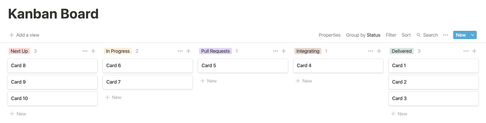

# Pull Requests and Kanban

GitHub pull requests have been the central part of
my teams' workflows for more than 10 years.

An outer, lighter layer of those workflows
has been a kanban board to manage tasks.
I've mostly used [Trello](https://trello.com)
but lately have been falling in love with [Notion](https://notion.so).
Here's an example board:



We add new work to the board as a card in the "Next Up" column.
It might represent a feature, bug, or chore.
Cards are sorted by priority.
To start a new task,
I put my face on the top unassigned card in "Next Up",
move it to "In Progress",
and make a branch:

```
git checkout -b my-branch
```

I make my changes and then commit them to version control:

```
git add --all
git commit --verbose
```

I push the feature to a remote branch:

```
git push
```

I open a pull request from the command line
with the [GitHub CLI](https://cli.github.com/):

```
gh pr create --web
```

This opens a new pull request form in a web browser,
I make adjustments to the pull request title and description
and open it.

A GitHub webhook starts a [CI] build.
Another GitHub webhook posts the pull request to a team [Slack] channel.
I move the card to the "Pull Requests" column.

[CI]: https://www.martinfowler.com/articles/continuousIntegration.html
[Slack]: https://slack.com

A teammate clicks the link in the Slack channel.
The teammate comments in-line on the code,
[offers feedback, and approves it][pr].

[pr]: https://help.github.com/articles/about-pull-request-reviews/

Code review before code lands in `master` offers these benefits:

* The whole team learns about new code as it is written.
* Mistakes are caught earlier.
* Coding standards are likely to be established and followed.
* Feedback is likely to be applied.
* Context ("Why did we write this?") is less likely to be forgotten.

I make the suggested changes and commit them:

```
git add --all
git commit -v
```

We've usually had these branch protection rules enabled:
"Require pull request reviews before merging",
"Require status checks to pass before merging",
and "Require branches to be up to date before merging".
So, I might need to push again:

```
git push
```

We've usually had this merge button setting enabled:
"Allow squash merging".
So, when CI passes again,
I merge changes into one commit on `master`
using the "Squash and merge" button.

After the pull request merges cleanly,
back on the command line in `my-branch`, I run
[this script](https://github.com/croaky/laptop/blob/master/bin/git-post-land):

```
git post-land
```

It runs some cleanup and moves me back to `master`:

```
git checkout master
git fetch origin
git merge --ff-only origin/master
git branch -D "$branch"
git remote prune origin
```

I move the card to the "Integrating" column.
This state is for the time period when
web apps are continuously delivered to a staging environment,
mobile apps are continuously delivered as ad-hoc builds,
and team members are acceptance testing.

When everything looks good,
the code is deployed to production and the card moves to "Delivered".
